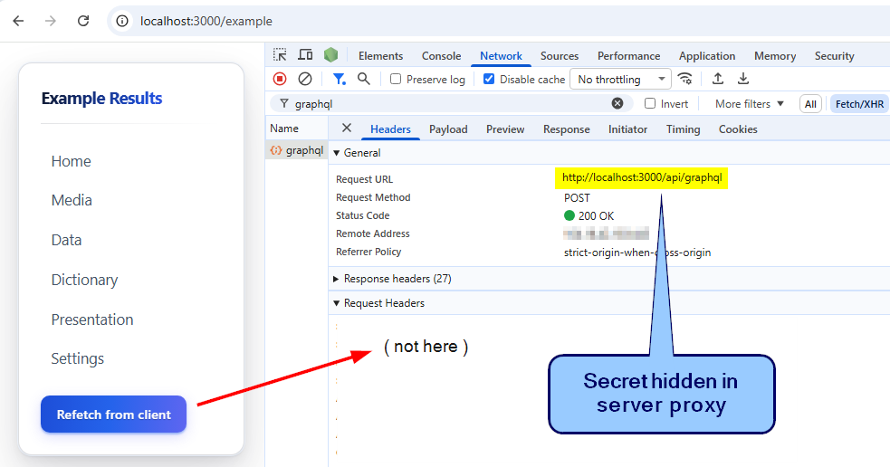
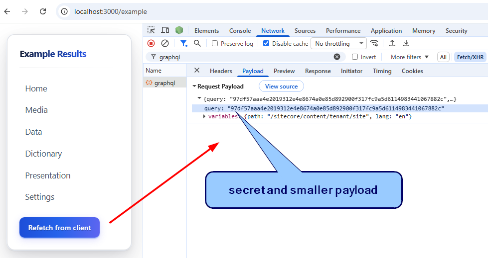
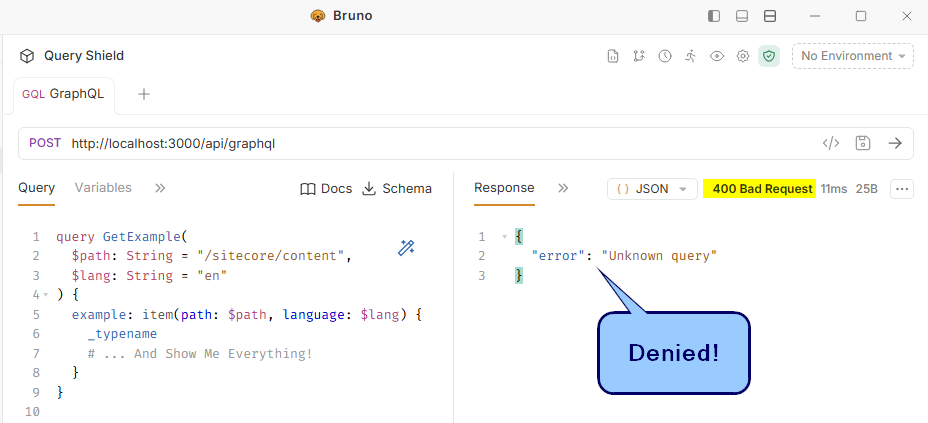
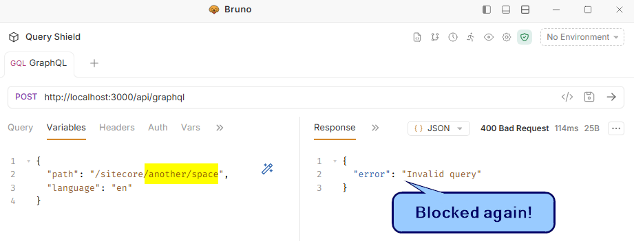

# Query Shield — lock down Sitecore GraphQL access

## Features

1. NEXT_PUBLIC_USE_SHIELD=true: proxy client-side Sitecore queries to hide Context Id or API Key
   

2. NEXT_PUBLIC_SHIELD_QUERY=true: hash queries in codebase and deny other query payloads
   
   

3. SHIELD_VARIABLES=true: block out-of-scope **path** and common **id** variable values
   

# How to run this example repo

- Rename `env.example` to `.env`
  - Set your Sitecore Config Values

```
SITECORE_EDGE_CONTEXT_ID=
NEXT_PUBLIC_DEFAULT_SITE_NAME=
```

- `npm i`
- `npm run dev`
- Open https://localhost:3000/example

# How to add to existing project

- This example repo is compatible with Next.js 16, Context SDK 2.0.1
- Add .env vars
  - These are typically false for local dev, enabled in deployed apps

```
# ============================================================================
# Query Shield - Opt in to security feature for client queries
#   NEXT_PUBLIC_USE_SHIELD: true/false - enable shield feature which enables GraphQL proxy route for client queries
#   NEXT_PUBLIC_SHIELD_QUERY: true/false - use hash ID from browser, only allow known queries
#   SHIELD_VARIABLES: true/false - restrict path or id variable values
#   TEMP_SHIELD_BYPASS_AND_LOG: true/false - log queries that would be blocked and allow bypass (intended to find and add to known queries)
# ============================================================================
NEXT_PUBLIC_USE_SHIELD=false
NEXT_PUBLIC_SHIELD_QUERY=false
SHIELD_VARIABLES=false
TEMP_SHIELD_BYPASS_AND_LOG=false #Keep false unless actively troubleshooting blocked queries
```

- Ensure you REMOVE this variable if present
  - `NEXT_PUBLIC_SITECORE_EDGE_CONTEXT_ID=`

- Add these files:
  - /loaders/\*
  - /src/app/api/graphl/\*
  - /src/lib/shield/\*

- Merge these files:
  - /src/lib/sitecore-client.ts
    - (change SitecoreClient to SitecoreServerProxyClient)
  - /next.config.ts
    - (turbopack)
  - /sitecore.cli.config.ts
    - (last build command, writeQueryShieldRegistry())
  - /.gitignore
    - \*.shield.ts
    - .shield/\*
- Run npm build
  - notice files generated under .shield/\*
  - **client queries will now proxy to /api/graphql and use hash ID for query**

- To add the example page, add these files:
  - /src/app/[site]/[locale]/example/\*
  - /src/components/exampe/\*
  - /src/lib/example/\*

# Summary of implementation:

1. `NEXT_PUBLIC_USE_SHIELD=true`

- Enables Sitecore GraphQL Proxy using `SitecoreServerProxyClient()` in sitecore-client.ts
- **Context aware SitecoreClient**
  - if browser, post query to new server proxy /api/graphql
  - else server, post to Sitecore endpoint with server-side secret

2. `NEXT_PUBLIC_SHIELD_QUERY=true`

- Assumes all your graphql queries are imported from \*graphql.ts files
- Registers \*graphql.ts files on build to gate proxied requets
  - `sitecore.cli.config` **build command**, writeQueryShieldRegistry(), generates lookup file
  - Proxy, /api/graphql, verifies incoming query matches list
- Obfuscate browser-side queries and minimizes payload size
  - `sitecore.cli.config` **build command**, writeQueryShieldRegistry():
    - generates \*graphql.shield.ts file next to query file with same const but hashed id for query.
    - generates import alias list
  - `next.config.ts` turbopack loader replaces the shield.ts file for the graphql.ts file on build (for client bundle only)

3. `SHIELD_VARIABLES=true`

- **Proxy route** sniffs for "id" or "path" variables and validates values against hard coded lists.
- Manage **allow/deny lists** in `/src/app/api/graphql/route.ts`
